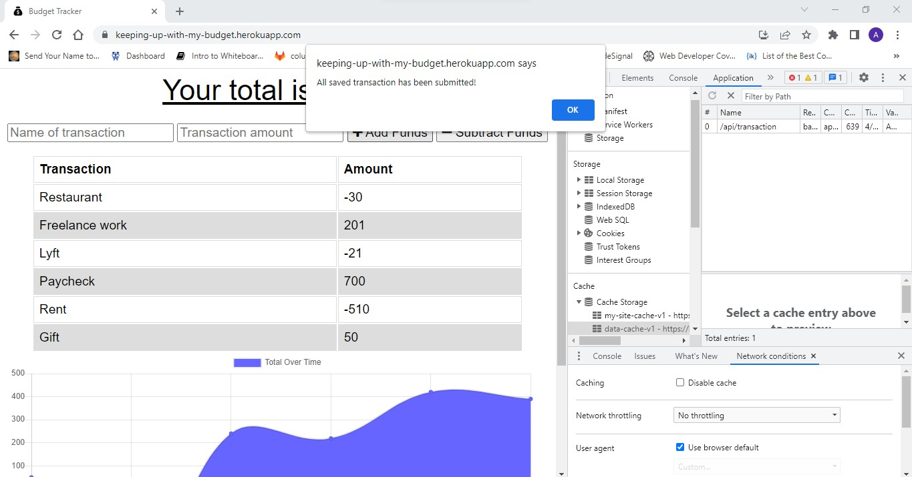

# Budget Tracker Starter Code

## Table of Contents
* [Description](#description)
* [Technologies Used](#technologies-used)
* [Installation](#installation)
* [Usage](#usage)
* [Contributing](#contributing)
* [Images](#images)
* [Deployed URL](#deployed-url)
* [Questions](#questions)

### Description
A social netowrk API that uses a NoSQL database to enable a website to handle large amounts of data

### Technologies Used
* Node.js
* MongoDB
* Mongoose
* JavaScript
* PWAs

### Installation
1. Clone repository using `git clone git@github.com:ajmarrocco/keeping-up-with-my-budget.git`
2. Type `npm i` or `npm install` to install all dependencies
3. Type `npm start` or `node server` to start database

### Usage 
All dependencies must be installed prior to using application

### Contributing 
Pull requests are reviewed

### Images
Homepage after adding some transactions

Notification of added expense or deposit without internet connection

Message that all saved transactions have been submitted

Final homepage after updated transaction history and total

### Deployed URL
https://keeping-up-with-my-budget.herokuapp.com/

### Questions
If you have any questions about opening an issue or the repository itself, please contact me at ajmarrocco@gmail.com. Please visit https://github.com/ajmarrocco for more of my projects!